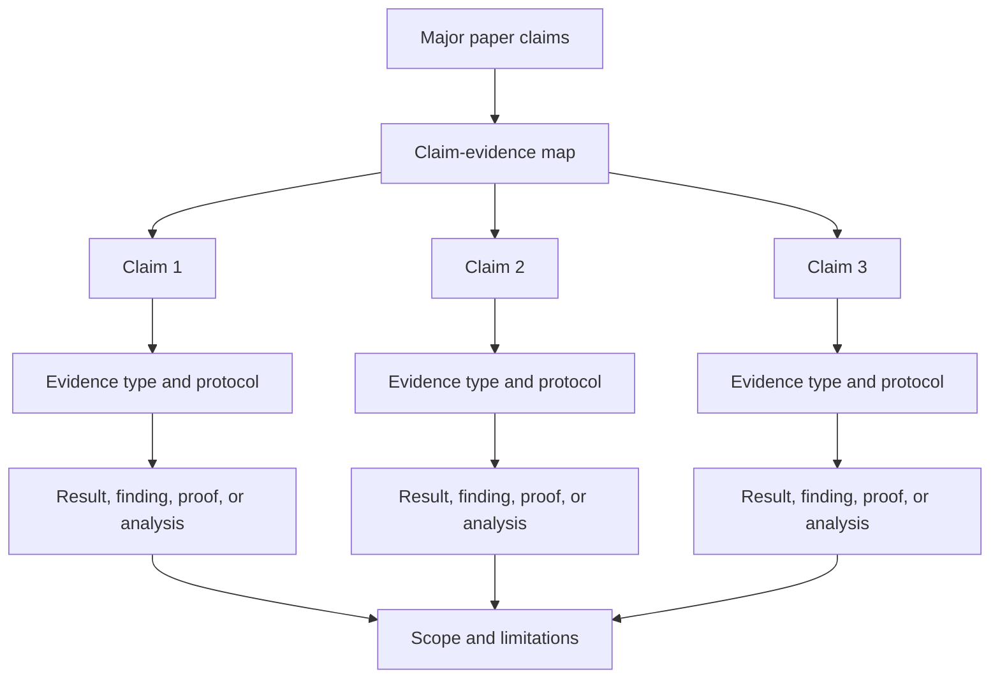

# Evaluation and Evidence Writing Guide

## Goal

Convince reviewers that the paper's claims are supported by appropriate evidence. Evidence may include experiments, proofs, user studies, measurements, security analysis, artifact evaluation, case studies, formal reasoning, qualitative analysis, or deployment experience.

The section title may be Evaluation, Experiments, Results, Analysis, Proofs, Study, Measurement, Case Study, Artifact Evaluation, or a combination, depending on the paper type.

## Core Questions

1. What claims does the paper make?
2. What evidence type is appropriate for each claim?
3. Is the evidence strong enough for the wording of the claim?
4. What are the limits, assumptions, and threats to validity?
5. Are figures and tables readable enough for reviewers to verify the claims quickly?

## Evidence Type Matrix

| Claim type | Suitable evidence | Common checks | Typical limitation to state |
|---|---|---|---|
| Performance, scalability, efficiency | Experiments, workload evaluation, profiling, deployment data | Baselines when applicable, workload realism, variance, resource accounting | Hardware, workload, scale, implementation maturity |
| Correctness or safety property | Proof, formal model, verification, exhaustive tests, invariants | Assumptions, theorem scope, model fidelity, counterexamples | Model boundaries, unverified implementation details |
| Security claim | Threat model, attack evaluation, defense evaluation, formal argument, empirical analysis | Attacker capabilities, false positives/negatives, bypasses, ethical handling | Threat model scope, platform dependence, disclosure limits |
| Usability or human behavior | User study, field study, qualitative analysis, survey, interviews | Recruitment, tasks, measures, coding reliability, ethics | Population, context, ecological validity |
| Empirical phenomenon | Measurement, dataset when applicable, statistical analysis, case studies | Sampling, instrumentation, validation, bias, robustness | Time window, platform/geography, observational limits |
| Design or system usefulness | Case studies, artifact evaluation, deployment, expert feedback, comparative analysis | Reproducibility, task relevance, integration cost | Generality, adoption assumptions, maintenance cost |
| Theoretical improvement | Theorem, proof, bound comparison, reduction, tightness example | Assumptions, parameter regimes, proof completeness | Model idealization, constants, applicability |
| Tool effectiveness | Corpus study, user/developer study, precision/recall analysis, performance evaluation | Dataset/corpus representativeness when applicable, oracle quality, error analysis | Corpus scope, labeling uncertainty, unsupported languages/settings |

## Evidence Planning

## Section Decomposition

Use the structure that matches the evidence, not a fixed experiment template.

### General Structure

1. **Setup / Methodology**: State research questions, claims, evidence type, protocol, assumptions, and scope.
2. **Main Evidence**: Present the evidence for the central claim first.
3. **Supporting Evidence**: Present secondary claims, robustness, mechanisms, qualitative findings, or case studies.
4. **Validity / Limitations**: Explain threats to validity, assumptions, failure cases, and boundaries.
5. **Takeaway**: End each subsection with the claim that the evidence supports.

### Possible Subsections

1. Evaluation setup or methodology.
2. Main result, theorem, finding, or case study.
3. Performance, scalability, usability, correctness, security, or measurement results as applicable.
4. Sensitivity analysis, ablation, or component analysis when applicable.
5. Robustness checks, error analysis, failure cases, or alternative explanations.
6. Artifact evaluation or reproducibility notes when applicable.
7. Threats to validity, limitations, ethics, or scope.

## Writing Evidence Subsections

For each subsection, use this paragraph order:

1. **Question**: What claim or research question does this subsection address?
2. **Protocol**: How was the evidence produced?
3. **Result**: What did the evidence show?
4. **Interpretation**: Why does the result support the claim?
5. **Boundary**: What should readers not infer?

Sentence patterns:

1. `This subsection evaluates whether [claim].`
2. `We use [evidence method] because [reason it matches the claim].`
3. `The results show [finding/property], supporting [claim].`
4. `This evidence does not establish [stronger claim], because [scope boundary].`

## Evidence-Specific Guidance

### Experiments and System Evaluation

1. State workload, environment, metrics, protocol, and comparison points.
2. Use baselines, benchmarks, datasets, or public methods when applicable and relevant.
3. Report variance, resource use, and fairness of comparison when important.
4. Include stress tests and failure cases when they reveal scope.
5. Use ablation or sensitivity analysis only when it tests a design claim.

### Proofs and Formal Arguments

1. State theorem claims, assumptions, and definitions before proof details.
2. Give proof intuition before technical steps.
3. Explain how lemmas compose into the main result.
4. State model limitations and whether implementation matches the model.

### User Studies and Qualitative Evidence

1. State research questions, participants, recruitment, tasks, procedure, and ethics.
2. Separate observations from interpretations.
3. Report coding process, inter-rater agreement, triangulation, or audit process when applicable.
4. Avoid overgeneralizing beyond the participant population and context.

### Measurement Studies

1. State sampling frame, collection period, instrumentation, filters, and validation.
2. Discuss bias, missing data, representativeness, and robustness checks.
3. Use statistics that match the data and claim.
4. Distinguish correlation, causation, prevalence, and anecdotal examples.

### Security Analysis

1. State threat model before results.
2. Evaluate both success cases and bypass/failure cases.
3. Report false positives, false negatives, cost, and operational constraints when relevant.
4. Address ethics, disclosure, and reproducibility boundaries.

### Artifact Evaluation

1. State what artifact exists and what claims it supports.
2. Explain installation, inputs, outputs, reproducibility, and expected runtime.
3. Distinguish artifact availability from scientific validity.
4. Connect artifact checks to the paper's main claims.

### Case Studies

1. Explain why the case is representative, extreme, or illuminating.
2. State what claim the case can support.
3. Use the case to explain mechanisms, tradeoffs, or failure modes.
4. Do not present a single case as broad proof unless justified.

## Figure/Table Writing Rules

Good figures and tables are part of evidence quality, not decoration.

### Hard rules

1. Put captions above tables.
2. Avoid vertical lines in tabular columns.
3. Do not use double rules or dense rule stacks.
4. Use `booktabs` style (`\toprule`, `\midrule`, `\bottomrule`) for clean structure.
5. Use as few horizontal rules as possible; lines should separate groups, not every row.
6. Highlight key numbers, findings, or categories sparingly.

### Readability rules

1. Label metric direction in column headers when applicable, such as `Latency ↓` or `Accuracy ↑`.
2. Add units so values are interpretable without guessing.
3. Align text columns left and numeric columns consistently.
4. Keep numeric precision consistent within each metric.
5. Group multi-setting results with clear headers rather than visual clutter.
6. One table, one message: do not mix unrelated evidence in a single table.
7. If rows represent different attributes, settings, claims, or conditions, encode that explicitly.
8. Keep captions focused on protocol, notation, and takeaway.
9. For qualitative tables, state coding scheme, source, or interpretation boundary.
10. For proof or theory tables, state parameter meanings and assumptions.

### Minimal LaTeX checklist

1. Add packages in preamble: `\usepackage{booktabs}`, `\usepackage{colortbl,xcolor}` when highlighting is needed, and optionally `\usepackage{siunitx}` for decimal alignment.
2. Replace `\hline`-heavy style with `\toprule/\midrule/\bottomrule`.
3. Put `\caption{...}` before `\label{...}` and keep table captions above.
4. Use restrained highlighting; never color too many cells.

## Ablation and Sensitivity Analysis When Applicable

Use ablation or sensitivity analysis only when the paper claims that a separable design choice, parameter, component, rule, or assumption matters.

Good uses:

1. Testing whether a system component is necessary.
2. Showing how a parameter affects performance, accuracy, cost, or robustness.
3. Comparing alternative design choices.
4. Checking whether a conclusion holds under different assumptions, workloads, populations, or sampling choices.

Avoid ritual ablations that do not correspond to a paper claim.

## Rigor Checklist

1. Does every major claim have a matching evidence type?
2. Is the evidence strong enough for the claim wording?
3. Are protocols, assumptions, and scopes clear enough to reproduce or audit?
4. Are comparison points, baselines, benchmarks, datasets, or workloads included only when applicable and justified?
5. Are limitations and threats to validity explicit?
6. Do figures and tables communicate the evidence without forcing readers to search the text?
7. Are Abstract and Introduction claims supported by results, proofs, findings, analyses, or other evidence reported in the paper?
