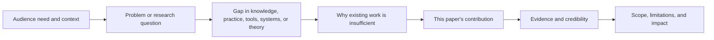

# Introduction Writing Guide

## Goal

Write an introduction that gives reviewers a compelling reason to care, a precise research question, a clear gap, a credible contribution, and an evidence-backed scope.

## Universal Introduction Arc

Use this story arc for computer science papers across systems, security, programming languages, theory, HCI, measurement, software engineering, and related areas:

1. **Context / Audience Need**: What community, user, developer, operator, theorist, or stakeholder needs this result?
2. **Problem / Research Question**: What exact question or problem does the paper address?
3. **Gap**: What is missing from prior work, current practice, existing theory, or available evidence?
4. **Insufficiency of Prior Work / Practice / Theory**: Why do existing approaches not close the gap?
5. **Contribution**: What does this paper contribute, and what is the core idea?
6. **Credibility / Evidence**: What evidence supports the contribution?
7. **Scope / Impact**: Where does the result apply, what does it enable, and what are the boundaries?

## Logic Map



## Backward First, Then Forward

### Backward reasoning: answer these before writing

1. What is the paper's central claim or answer to the research question?
2. What exact gap must readers believe before they value the contribution?
3. Which prior work, practice, or theory best exposes that gap?
4. What evidence supports the claim: experiments, proofs, measurements, user studies, analyses, artifact evaluation, case studies, or deployment?
5. What scope boundaries prevent overclaiming?

### Forward story: write in this order

1. Establish context and audience need.
2. State the problem or research question.
3. Explain the gap and why it persists.
4. Position prior work, practice, or theory around that gap.
5. Present the contribution and its core insight.
6. Preview evidence and credibility.
7. State scope, impact, and contributions.

## Section Skeleton

```latex
\section{Introduction}
% Context and audience need
% Problem or research question
% Gap and insufficiency of prior work/practice/theory
% Contribution and core idea
% Evidence and credibility
% Scope, impact, and contribution list
```

## Paragraph Roles

### 1) Context / Audience Need

Purpose: make the reader care before asking them to understand details.

Writing structure:

1. Name the area or setting.
2. Identify the audience need or consequence.
3. Narrow toward the paper's specific problem.

Sentence patterns:

1. `[Community/stakeholders] increasingly rely on [systems/tools/theory/process] to [goal].`
2. `However, [desired property] remains difficult when [condition].`
3. `This paper focuses on [specific setting/question], where [stakes].`

### 2) Problem / Research Question

Purpose: turn a broad topic into a precise target.

Writing structure:

1. State the problem or question directly.
2. Define key terms and boundary conditions.
3. Explain why the answer is not obvious.

Sentence patterns:

1. `This paper asks: [research question]?`
2. `The central problem is to [do/understand/prove/build/measure] [target] under [constraints].`
3. `The difficulty is not merely [surface issue], but [deeper reason].`

### 3) Gap

Purpose: identify what is missing, not merely that prior work exists.

Writing structure:

1. State what current work, practice, or theory provides.
2. State the missing capability, explanation, guarantee, evidence, or design principle.
3. Tie the missing piece to the research question.

Sentence patterns:

1. `Existing work has established [known result/capability], but it does not explain/provide/support [missing piece].`
2. `Current practice often [practice], yet this leaves [risk/cost/uncertainty].`
3. `Prior evidence is limited to [scope], leaving open whether [question].`

### 4) Prior Work / Practice / Theory Insufficiency

Purpose: show why the gap persists despite relevant work.

Writing structure:

1. Group related work by idea, assumption, or evidence type instead of listing papers.
2. For each group, state what it contributes and why it is insufficient for this paper's question.
3. End with the precise unresolved issue your paper addresses.

Sentence patterns:

1. `One line of work [does X], which helps with [benefit] but assumes [assumption].`
2. `Another line [does Y], but its evidence is limited to [scope] and cannot establish [needed claim].`
3. `As a result, we still lack [artifact/guarantee/explanation/evidence] for [target setting].`

Warning: do not write the introduction as “a naive solution fails, so we add a small fix.” Even incremental work should be framed through the real research question, gap, and evidence.

### 5) Contribution

Purpose: state what the paper adds and why it closes the gap.

Writing structure:

1. Name the contribution type: system, theorem, model, analysis, dataset, tool, study, taxonomy, framework, protocol, design, or finding.
2. State the core idea in one reader-friendly sentence.
3. Explain why the idea addresses the gap.
4. Use an overview, architecture, proof-roadmap, study-workflow, or measurement figure when applicable.

Sentence patterns:

1. `We present [contribution], a [type] that [core function/idea].`
2. `The key idea is to [principle], which allows [benefit] without requiring [unwanted assumption/cost].`
3. `Figure X provides an overview of [architecture/workflow/proof structure/measurement design].`

### 6) Credibility / Evidence

Purpose: preview how the paper supports its claims.

Writing structure:

1. Match evidence to claims.
2. State only the strongest, most relevant result or finding.
3. Avoid unsupported generalization.

Sentence patterns:

1. `We evaluate [claim] using [evidence type] across [scope].`
2. `The analysis proves [property] under [assumptions].`
3. `The study shows [finding] for [population/context].`
4. `The measurements reveal [finding] over [sampling frame/time window].`

### 7) Scope / Impact / Contributions

Purpose: close the introduction with a clear promise and honest boundary.

Writing structure:

1. State what the contribution enables.
2. State scope conditions when important.
3. List contributions in parallel form.

Contribution list pattern:

1. `We formulate [problem/question] and identify [gap].`
2. `We introduce [contribution] based on [core idea].`
3. `We provide [evidence] showing [supported claim].`
4. `We release/report/prove/analyze [artifact/result] to support [use], when applicable.`

## Field-Specific Templates

### Systems

1. Operators/developers need a system property under realistic constraints.
2. Existing systems or practice handle part of the requirement but fail under a workload, scale, fault model, or deployment constraint.
3. The paper contributes an architecture, abstraction, algorithm, runtime, protocol, or tool.
4. Evidence comes from implementation, workload evaluation, stress testing, resource analysis, deployment, or artifact evaluation.
5. Scope states hardware, workload, scale, assumptions, and integration limits.

### Security

1. A threat, asset, or abuse pattern creates risk.
2. Existing defenses, analyses, or assumptions miss a threat or impose unacceptable cost.
3. The paper contributes an attack, defense, formalization, tool, protocol, or measurement.
4. Evidence comes from threat modeling, exploit/defense evaluation, formal argument, empirical analysis, or responsible disclosure outcomes.
5. Scope states attacker model, platform, assumptions, ethics, and limitations.

### Programming Languages / Software Engineering

1. Developers or tools need correctness, expressiveness, maintainability, or automation.
2. Existing languages, analyses, verification methods, or tools miss a property or do not scale to a setting.
3. The paper contributes a language design, type system, analysis, verification method, synthesis technique, or developer tool.
4. Evidence comes from soundness proofs, implementation, corpus studies, performance analysis, or user/developer studies.
5. Scope states language subset, property class, completeness, and assumptions.

### Theory / Algorithms

1. A fundamental problem or model has an unresolved regime.
2. Prior bounds, reductions, or algorithms leave a gap.
3. The paper contributes a theorem, algorithm, lower bound, characterization, or proof technique.
4. Evidence is the proof, bound comparison, tightness discussion, and implications.
5. Scope states model assumptions and parameter regimes.

### HCI / Human-Centered Computing

1. People or organizations face an interaction, design, coordination, or interpretation problem.
2. Existing systems, design practice, or theory does not adequately support or explain the need.
3. The paper contributes a design artifact, empirical study, method, theory, taxonomy, or set of design implications.
4. Evidence comes from qualitative analysis, controlled study, field deployment, design critique, or triangulation.
5. Scope states participant population, context, ecological validity, and ethical considerations.

### Measurement / Empirical CS

1. A phenomenon matters to researchers, practitioners, users, or policy.
2. Existing evidence is outdated, narrow, indirect, or inconsistent.
3. The paper contributes a measurement method, dataset when applicable, taxonomy, empirical finding, or causal/associational analysis.
4. Evidence comes from sampling design, validation, statistical analysis, robustness checks, and case studies.
5. Scope states sampling frame, time window, platform/geographic coverage, and observational limits.

## Quick Quality Checklist

1. Does each paragraph have one message and a clear first sentence?
2. Does the introduction move from audience need to research question to gap to contribution to evidence?
3. Is prior work grouped by insufficiency rather than listed chronologically?
4. Are claims aligned with evidence from the rest of the paper?
5. Are scope and assumptions explicit enough to avoid overclaiming?
6. Is terminology stable across sections?
