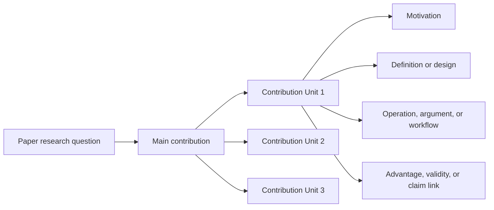

# Technical Core Writing Guide

## Goal

Write the technical core of a computer science paper so reviewers can understand what is contributed, why it is needed, how it works, and what claim each part supports.

Use “Method” only when the paper is actually method-centered. For many CS papers, this section may be called Design, System, Approach, Model, Algorithm, Analysis, Proof Overview, Study Design, Measurement Methodology, Threat Model, or Implementation.

## Contribution Unit

Use the general **Contribution Unit** as the organizing concept instead of assuming a fixed method structure.

A Contribution Unit is any separable part of the paper's technical contribution, such as:

1. a system component or architecture decision,
2. an algorithm, protocol, abstraction, or data structure,
3. a theorem, lemma, proof technique, model, or reduction,
4. a security threat model, attack step, defense mechanism, or analysis rule,
5. a programming-language construct, type rule, static analysis, runtime check, or tool workflow,
6. an HCI study procedure, design artifact, coding scheme, or analysis method,
7. a measurement workflow, sampling method, validation step, taxonomy, or instrumentation design,
8. an artifact, benchmark, dataset, or workload only when it is itself a contribution.

## Pre-Writing Questions

Before writing the technical core, answer:

1. What are the paper's Contribution Units?
2. For each unit, what claim does it support?
3. What problem or gap makes this unit necessary?
4. How does the unit work, in execution order, logical order, proof order, or study workflow order?
5. Why is this unit sound, effective, valid, usable, scalable, secure, or informative?
6. What assumptions, inputs, outputs, constraints, and failure cases should readers know?
7. What figure, table, theorem statement, pseudocode, example, or diagram would make the unit easier to understand?

## Technical Core Writing Steps

1. Choose the organizing structure: architecture, algorithm, proof roadmap, study workflow, measurement design, threat model, or contribution sequence.
2. Draw or describe the main overview artifact when applicable: overview figure, architecture diagram, proof-roadmap diagram, study-workflow diagram, measurement diagram, protocol sequence, state machine, or table of concepts.
3. Map subsections to Contribution Units, not to incidental implementation details.
4. For each subsection, plan four parts: motivation, definition/design, operation/argument, and advantage/claim.
5. Write the concrete technical content first; add motivation and advantages around it.
6. End each unit by explaining what claim it enables and where the evidence appears.

## Four Elements of a Contribution Unit

### 1) Motivation

Explain why this unit exists.

1. State the gap, constraint, or unresolved issue.
2. Connect it to the paper's research question.
3. Avoid framing the unit as a small patch unless that is the actual contribution.

Sentence patterns:

1. `The key challenge is [challenge] because [reason].`
2. `To answer [research question], we need [capability/guarantee/evidence].`
3. `This motivates [Contribution Unit], which [purpose].`

### 2) Definition or Design

Define the unit precisely.

1. Name inputs, outputs, assumptions, and key terms.
2. Give formal definitions, design choices, procedures, or artifacts.
3. Use notation, examples, pseudocode, diagrams, or tables when they reduce ambiguity.

Sentence patterns:

1. `We define [term] as [definition] under [assumptions].`
2. `The unit takes [input] and produces [output].`
3. `The design consists of [parts], each responsible for [role].`

### 3) Operation, Argument, or Workflow

Explain how the unit works.

1. For systems: describe request/data/control flow, state changes, resource use, and failure handling.
2. For security: describe attacker model, attack/defense steps, assumptions, and validation logic.
3. For programming languages: describe syntax/semantics, rules, analysis flow, invariants, and implementation strategy.
4. For theory: describe theorem structure, proof roadmap, lemmas, reductions, and parameter regimes.
5. For HCI: describe participants or stakeholders, procedure, tasks, prompts, coding, and analysis workflow.
6. For measurement: describe sampling, instrumentation, cleaning, validation, metrics, and analysis.

Sentence patterns:

1. `Given [input/condition], the unit first [step], then [step], and finally [result].`
2. `The proof proceeds by [main idea], with Lemma X establishing [property] and Lemma Y handling [case].`
3. `The study workflow begins with [step] and uses [analysis method] to derive [finding type].`
4. `The measurement design collects [signal] from [source], validates it by [check], and analyzes [quantity].`

### 4) Advantage, Validity, or Claim Link

Explain why the unit matters.

1. Tie the unit to a claim in the Introduction.
2. State what evidence will support it.
3. Name tradeoffs and assumptions honestly.

Sentence patterns:

1. `This design supports the claim that [claim] because [reason].`
2. `The corresponding evidence appears in Section X, where we [evaluate/prove/measure/study/analyze] [property].`
3. `The tradeoff is [cost/assumption], which is acceptable in [scope] because [reason].`

## Content Decomposition

## Overview Subsection

The overview should orient readers before details.

Writing structure:

1. State the setting, inputs, assumptions, and goal.
2. State the main contribution in one or two sentences.
3. Point to an overview artifact when applicable.
4. Explain how subsections map to Contribution Units.
5. Preview where evidence appears if useful.

Possible overview artifacts:

1. overview diagram,
2. architecture diagram,
3. protocol sequence diagram,
4. proof-roadmap diagram,
5. study-workflow diagram,
6. measurement diagram,
7. threat-model diagram,
8. taxonomy or concept table.

## Field-Specific Technical Core Patterns

### Systems

1. Start with goals, non-goals, assumptions, and deployment setting.
2. Present architecture and core abstractions.
3. Describe request/control/data flow in execution order.
4. Explain key design choices, tradeoffs, and failure handling.
5. Include implementation details only when they affect claims or reproducibility.

### Security

1. State assets, attacker capabilities, trust assumptions, and ethical boundaries.
2. Present the attack, defense, protocol, or analysis in steps.
3. Explain why assumptions are realistic and where the design may fail.
4. Tie claims to security properties, empirical evidence, formal reasoning, or case studies.

### Programming Languages / Software Engineering

1. Define syntax, semantics, properties, or tool workflow before examples.
2. State rules or algorithms precisely enough to reproduce.
3. Explain invariants, soundness arguments, precision/recall tradeoffs, or scalability constraints.
4. Use examples to show why the rule or tool catches meaningful cases.

### Theory / Algorithms

1. State the model, assumptions, definitions, and theorem before proof details.
2. Provide proof intuition before technical lemmas.
3. Organize by lemmas, cases, reductions, or algorithm phases.
4. Clarify parameter regimes, tightness, and limitations.

### HCI / Human-Centered Computing

1. State research questions, context, participants/stakeholders, and ethics.
2. Describe study design, artifacts, tasks, protocol, and analysis method.
3. Explain why the design can answer the research questions.
4. Separate observations, interpretations, and design implications.

### Measurement / Empirical CS

1. State the phenomenon, sampling frame, instrumentation, and collection period.
2. Explain data cleaning, validation, bias checks, and metrics.
3. Present analysis workflow and robustness checks.
4. Clarify what can and cannot be inferred from the data.

## Implementation Details

Include implementation details when they are necessary for reproducibility, validity, or interpreting evidence.

Useful details may include:

1. system configuration, hardware, software versions, dependencies,
2. parameter settings and thresholds,
3. workload, benchmark, or dataset details when applicable,
4. proof assumptions and model parameters,
5. recruitment, consent, coding, and analysis procedures,
6. sampling, filtering, and validation rules,
7. artifact packaging and reproducibility instructions.

Do not bury the core idea under low-level details. Put routine details near the end, in an appendix, or in an artifact description when appropriate.

## Clarity Checks

### Logic-level check

1. Can a reader summarize the technical core as a sequence of Contribution Units?
2. Does each unit support a claim from the Introduction?
3. Are assumptions, inputs, outputs, and boundaries explicit?

### Paragraph-level check

1. Does the first sentence of each paragraph state its role?
2. Does each paragraph carry one message only?
3. Are examples and figures introduced before readers need them?

### Sentence-level check

1. Is the reason for each definition, step, or theorem clear?
2. Are terms used consistently?
3. Are causal claims separated from descriptive claims?

## Quick Quality Checklist

1. Is the section organized around Contribution Units rather than incidental details?
2. Is there an overview artifact when it would reduce cognitive load?
3. Does each unit include motivation, definition/design, operation/argument/workflow, and claim link?
4. Are assumptions and tradeoffs explicit?
5. Are claims connected to evidence in the evaluation, proof, study, analysis, or artifact sections?
